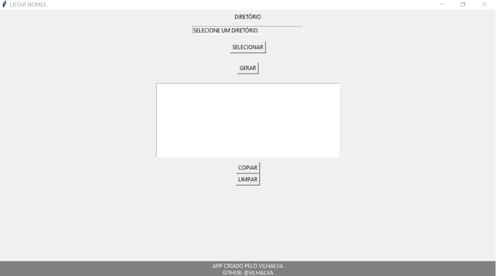

# COPY NAME
🎈COPIE O NOME DE TODOS OS ARQUIVOS DO SEU DIRETÓRIO.

 <br>

## DESCRIÇÃO:
O aplicativo em Python desenvolvido com a biblioteca Tkinter tem o propósito de facilitar a listagem dos nomes de arquivos em um diretório escolhido pelo usuário, sem incluir as extensões dos arquivos. A interface gráfica proporciona uma interação intuitiva. 

O aplicativo fornece uma solução eficiente para a tarefa específica de listar os nomes de arquivos em um diretório selecionado, tornando-o fácil de usar para usuários que desejam obter uma lista formatada para posterior utilização. A interface gráfica amigável facilita a interação, tornando o processo mais acessível, mesmo para aqueles com pouca experiência em linha de comando.

## RECURSOS:
1. **Seleção de Diretório:**
   - Um botão "Selecionar Diretório" permite que o usuário escolha o diretório no qual deseja listar os nomes dos arquivos.

2. **Campo de Exibição do Diretório:**
   - Um campo de entrada exibe o caminho do diretório selecionado. Esse campo é apenas de leitura (read-only) e ajuda o usuário a visualizar o diretório escolhido.

3. **Geração de Nomes de Arquivos:**
   - Um botão "GERAR" executa a função de coletar os nomes dos arquivos no diretório selecionado. Os nomes são exibidos no formato desejado (sem extensões) dentro de um campo de texto.

4. **Campo de Texto para Nomes de Arquivos:**
   - Um campo de texto exibe os nomes dos arquivos formatados como uma lista de strings, onde cada nome de arquivo está entre aspas e separado por vírgulas.

5. **Botões de Controle:**
   - Um botão "Copiar" permite que o usuário copie o conteúdo do campo de texto para a área de transferência, facilitando o uso posterior dos nomes.
   - Um botão "Limpar" apaga o conteúdo do campo de texto, oferecendo a opção de recomeçar a operação.

## EXECUTANDO O PROJETO:
1. Execute o arquivo Python.
2. Isso abrirá uma janela do aplicativo.
3. Clique no botão "SELECIONAR" para escolher o diretório que contém os arquivos cujos nomes você deseja listar.
4. Após selecionar o diretório, clique no botão "GERAR" para gerar a lista de nomes dos arquivos no diretório selecionado.
5. Os nomes dos arquivos serão exibidos na área de texto abaixo do botão "GERAR".
6. Se desejar, você pode clicar no botão "COPIAR" para copiar os nomes dos arquivos para a área de transferência.
7. Se desejar limpar a área de texto, clique no botão "LIMPAR".
8. Para sair do aplicativo, feche a janela.

## SOBRE O EXECUTAVEL:
### 1. EXECUTANDO:
- Este arquivo executável está disponível apenas para `Windows X64`. Para executá-lo, basta dar dois cliques. O executável é bastante útil caso o Python não esteja instalado. Trata-se da mesma aplicação do arquivo `CODIGO.py`. Se desejar, você pode recompilá-lo novamente; é para isso que forneci o arquivo `imagem.ico`.

### 2. GERANDO:
   **1. Instalação do [PyInstaller:](https://pyinstaller.org/en/stable/)**
   - Certifique-se de ter o PyInstaller instalado. Se não tiver, instale usando o comando abaixo:
   ```bash
   pip install pyinstaller
   ```

   **2. Gerando o Executável:**
   - Para gerar o executável, utilize o comando `pyinstaller` seguido de opções:
      - `--icon="imagem.ico"`: Especifica o ícone do executável.
      - `-w`: Especifica que o executável será do tipo "windowed", ou seja, sem exibir uma janela de console.
      - `-F`: Gera um único arquivo executável em vez de vários.
      - `CODIGO.py`: Substitua "CODIGO.py" pelo nome do seu arquivo Python principal.
   ```bash
   pyinstaller --icon="imagem.ico" -w -F CODIGO.py
   ```

## NÃO SABE?
- Entendemos que para manipular arquivos em muitas linguagens, é necessário possuir conhecimento nessas áreas. Para auxiliar nesse aprendizado, oferecemos cursos gratuitos disponíveis:
* [CURSO DE PYTHON](https://github.com/VILHALVA/CURSO-DE-PYTHON)
* [CURSO DE TKINTER](https://github.com/VILHALVA/CURSO-DE-TKINTER)
* [CURSO DE AUTOMACAO](https://github.com/VILHALVA/CURSO-DE-AUTOMACAO)
* [CONFIRA MAIS CURSOS](https://github.com/VILHALVA?tab=repositories&q=+topic:CURSO)

## CREDITOS:
- [PROJETO CRIADO PELO VILHALVA](https://github.com/VILHALVA)

